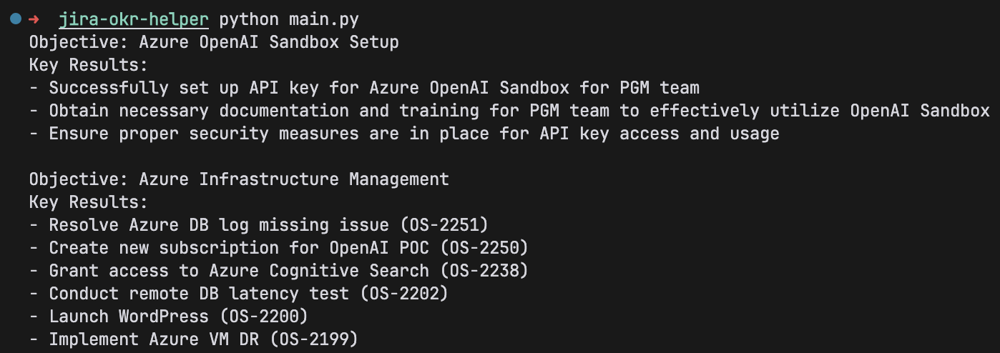

# JIRA OKR Helper

## Overview
This tool is to help you draft an OKR (Objectives and Key Results) document based on the JIRA tasks you have completed. The tool will analyze the tasks and extract relevant information to create a comprehensive OKR document, saving you valuable time and effort.

## Usage
1. Clone the repository to your local machine.
2. Copy the `.env.example` file to `.env`.
3. Install the required dependencies by running `pip install -r requirements.txt`.
4. Run the tool by executing `python main.py`.

## License
This project is licensed under the MIT License - see the LICENSE file for details.